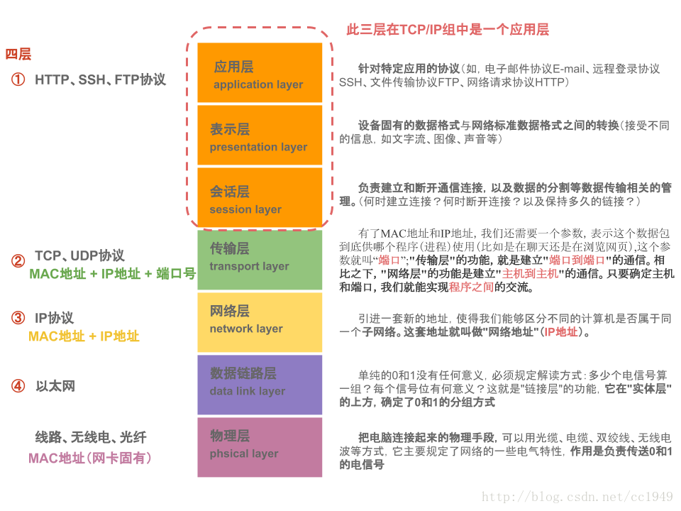
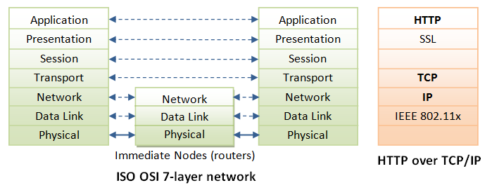
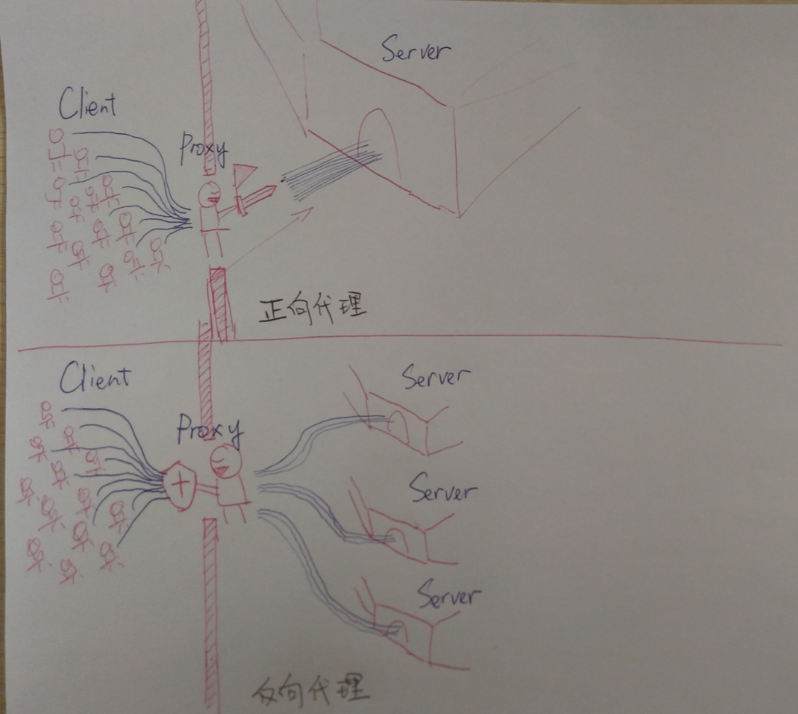

## 网络基础知识

[TOC]

### 〇、目标

1、针对项目中遇到的一些网络问题进行场景、方案梳理，提供一些解决方案，供抛砖引玉；

2、网络方面常用的工具，我们能使用这些工具做什么

### 一、网络 OSI 分层模型与 TCP/IP 分层模型基础

#### 1、ISO/OSI 七层模型介绍


#### 2、与 TCP/IP 四层模型对应关系



#### 3、数据包


#### 4、我们需要关注的内容

（1）应用层

- 我们日常的 Web 和 HTTP 相关开发位于这一层
- Nginx 工作在这一层（不考虑 Nginx 用作的 TCP 代理的场景），反向代理、负载均衡
- 常见协议：HTTP(S)、(S)FTP、FTP(S)、SSH
- 常用测试工具：根据协议选择相应工具，如：cURL、Postman 等，也可使用传输层工具进行测试

（2）传输层

- 针对于日常应用开发来说，这是我们能够接触到的最底层，是应用层的基础
- HAProxy 的 TCP 负载均衡工作在这一层
- 需要保证与设备联通状态和端口开放才能正常工作（在网络连通前提下，客户保证端口策略开放，我们保证端口正常提供服务）
- 常见协议：TCP、UDP、SCTP
- 常用测试工具：Ncat

（3）网络层

- 连通性与端口无关（项目中这一层不需要我们保障，由客户提供保证网络的连通）
- 常见协议：ICMP
- 常用测试工具：ping

参考：

- [*《网络7层协议，4层，5层？理清容易混淆的几个概念》*](https://blog.csdn.net/cc1949/article/details/79063439)
- [*《网络模型到底是七层，五层，还是四层？》*](https://zhuanlan.zhihu.com/p/73807507)


### 二、TCP 与 HTTP 的关系

#### 1、图示



参考：[*HTTP (HyperText Transfer Protocol) Basics*](https://www.ntu.edu.sg/home/ehchua/programming/webprogramming/HTTP_Basics.html)


#### 2、使用 Ncat 模拟 HTTP 请求

##### （1）正常访问

```http
$ ncat -C httpbin.org 80
GET /anything HTTP/1.1
```

返回结果：

```http
HTTP/1.1 200 OK
Date: Sat, 08 Feb 2020 00:25:02 GMT
Content-Type: application/json
Content-Length: 403
Connection: close
Server: gunicorn/19.9.0
Access-Control-Allow-Origin: *
Access-Control-Allow-Credentials: true

{
  "args": {},
  "data": "",
  "files": {},
  "form": {},
  "headers": {
    "Host": "798601f9-default-httpbinbe-0563-1016176207.us-east-1.elb.amazonaws.com",
    "X-Amzn-Trace-Id": "Root=1-5e3dffde-a59c48925f263c4aa6862ada"
  },
  "json": null,
  "method": "GET",
  "origin": "111.30.232.5",
  "url": "http://798601f9-default-httpbinbe-0563-1016176207.us-east-1.elb.amazonaws.com/anything"
}
```


##### （2）通过代理访问

```http
$ ncat 127.0.0.1 8016
GET http://google.com HTTP/1.1
```

返回结果：

```http
HTTP/1.1 301 Moved Permanently
Location: http://www.google.com/
Content-Type: text/html; charset=UTF-8
Date: Sat, 08 Feb 2020 00:35:09 GMT
Expires: Mon, 09 Mar 2020 00:35:09 GMT
Cache-Control: public, max-age=2592000
Server: gws
Content-Length: 219
X-XSS-Protection: 0
X-Frame-Options: SAMEORIGIN
X-Cache: MISS from gb1.pages.googol.gl
X-Cache-Lookup: MISS from gb1.pages.googol.gl:7228

<HTML><HEAD><meta http-equiv="content-type" content="text/html;charset=utf-8">
<TITLE>301 Moved</TITLE></HEAD><BODY>
<H1>301 Moved</H1>
The document has moved
<A HREF="http://www.google.com/">here</A>.
</BODY></HTML>
```


#### 3、使用 cURL 访问对照验证

- 正常访问

```bash
$ curl -v http://httpbin.org/anything
```

- 通过代理访问

```bash
$ curl -vx 'http://127.0.0.1:8016' http://google.com
```


### 三、常用网络工具

开发过程中最常用的 [Postman](https://www.postman.com/)、[httpbin.org](https://httpbin.org/) 大家都比较熟悉，而且内容较多，可以单开专题介绍，这里不再赘述。

这里只说场景和可以解决的问题，不深入讨论工具的使用。

参考：[*《Linux常用网络工具总结》*](https://int32bit.me/2016/05/04/Linux%E5%B8%B8%E7%94%A8%E7%BD%91%E7%BB%9C%E5%B7%A5%E5%85%B7%E6%80%BB%E7%BB%93/)

#### 1、cURL

可以作为众多应用层协议的客户端来使用，可用于对服务端进行测试。

- 多协议支持（应用层）

  DICT、FILE、FTP、FTPS、Gopher、HTTP、HTTPS、IMAP、IMAPS、LDAP、LDAPS、POP3、POP3S、RTMP、RTSP、SCP、SFTP、SMTP、SMTPS、Telnet、TFTP

- 命令行工具

  - 可用于脚本
  - 可以用于简易的 RESTful API 测试（专业工具详见 Newman）
  - cURL 写入代码注释，方便测试。Postman、Paw 之类的专业工具都可以生成对应的 cURL

- 可以追踪通讯细节（`-v`，`--trace`，`--trace-ascii`，`--trace-time`）

```bash
# 访问 httpbin，测试延迟 3 秒的请求
$ curl --trace-ascii traceinfo.txt --trace-time http://httpbin.org/delay/3
```


#### 2、Nmap

主机、端口扫描。

参考：

- [*<u>NMAP.ORG</u>*](https://nmap.org/)
- [*《Nmap 中文网》*](http://www.nmap.com.cn/)

- [*《Nmap 中文手册》*](http://www.nmap.com.cn/doc/manual.shtm)

端口扫描：

```bash
# 扫描端口状态
$ nmap -p 端口范围 主机

# 服务识别与版本探测
$ nmap -sV 主机

# 推测操作系统
$ sudo nmap -O --osscan-guess -Pn 主机
```


#### 3、Ncat

网络工具箱里的『瑞士军刀』。

参考：[*《Ncat Users' Guide》*](https://nmap.org/ncat/guide/)

（1）端口探测

```bash
# 探测 httpbin.org 的 80 端口
$ ncat -zv httpbin.org 80
```

使用场景：测试网络连通性和端口状态


（2）简易数据通讯

```bash
# 服务端
$ ncat -l 9999

# 如果服务端需要启用 SSL/TLS，--ssl-cert 指定 完整证书链
$ ncat -l 9999 --ssl-cert bundle.crt --ssl-key server.key
```


```bash
# 客户端
$ ncat 服务端 9999

# 如果要连接 SSL/TLS 服务器
$ ncat 服务端 9999 --ssl
```

使用场景：服务器间简单通讯，临时传递信息


（3）发送文件

```bash
# 从 HOST1（Client） 发送文件到 HOST2（Server） 的 TCP 9899 端口
# HOST2：
$ ncat -l 9899 > outputfile

# HOST1：
$ ncat HOST2 9899 < inputfile
```

使用场景：服务器间简单通讯，临时传递信息


（4）端口转发

```bash
# 重定向本机 9999 TCP 端口到 httpbin.org 的 80 端口
$ ncat --sh-exec "ncat httpbin.org 80" -l 9999 --keep-open
```

使用场景：辅助访问，将请求转发到目标端口


（5）分享 Shell

```bash
# 在本机的 9999 端口分享 Bash Shell，让对方可以通过网络访问此端口来自由访问 Bash Shell
$ ncat --exec "/bin/bash" -l 9999 --keep-open
```

使用场景：临时操作目标服务器，不能使用 SSH 的情况（不常见）


（6）通过代理服务器连接

```bash
# 通过 SOCKS5 1080 端口，连接 smtphost:25
$ ncat --proxy socks5host --proxy-type socks5 --proxy-auth proxyusername:password smtphost 25
```


适用场景举例：

```bash
# SSH 通过 Ncat 指定代理，通过代理访问
$ ssh -o ProxyCommand="ncat --proxy-type http/socks4/socks5 --proxy proxy.net:端口 %h %p" user@server.net
```


（7）创建代理服务器

```bash
# 在本机 8888 端口创建 HTTP 代理
$ ncat -l --proxy-type http localhost 8888
```

```bash
# 测试 HTTP 代理服务器（支持隧道模式）
$ curl -x 'http://localhost:8888' httpbin.org/anything
```

使用场景：临时提供正向代理服务，无需安装专业代理软件


#### 4、tcpdump

Linux 抓包工具。

（1）获取适配器列表

```bash
$ sudo tcpdump -D
```


（2）监听及过滤

```bash
$ sudo tcpdump -i ens33 host 192.168.1.2
```


参考：[*《抓包神器 tcpdump 使用介绍》*](https://cizixs.com/2015/03/12/tcpdump-introduction/)


#### 5、netcat / lsof

查看端口使用情况。在端口被占用时可以通过这种方式查看。

```bash
# 查看所有（-a）监听的（-l） TCP（-t） 端口及占用端口的进程（-p）
$ netstat -anlpt

# 查看占用端口号的进程
$ lsof -i :端口
```


#### 6、nslookup / dig

域名解析，处理域名解析失败的情况

```bash
# 安徽联通域名，只在省内可以访问
$ nslookup www.ah.uincom.local

# 百度
$ nslookup baidu.com
```


#### 7、route / traceroute

```bash
# 查看路由
$ route 

# 统计到目标主机的每一跳的网络状态（print the route packets trace to network host），这个命令常常用于判断网络故障，比如本地不通，可使用该命令探测出是哪个路由出问题了。如果网络很卡，该命令可判断哪里是瓶颈
$ sudo traceroute -I -n baidu.com
```


#### 8、aria2

多连接、多线程分块下载，支持 HTTP、FTP、磁力、BT 等下载。

参考：[*《aria2 （命令行下载器）实例》*](https://links.jianshu.com/go?to=https%3A%2F%2Flinux.cn%2Farticle-7982-1.html)


#### 9、tmux

- 多会话、多窗口、多面板
- 后台+工作状态保存
- 不受 SSH 连接状态影响

参考：[*《Tmux使用手册》*](http://louiszhai.github.io/2017/09/30/tmux/)


### 四、正向代理和反向代理服务器

#### 1、定义




#### 2、实际使用感受上的差异

以浏览器举例

正向代理：作为浏览器（或客户端）参数指定，访问的目标地址不变

反向代理：访问的目标地址就是反向代理本身


#### 3、实际使用场景中的作用

常见资料中已经描述不少：

正向代理：可用于翻墙缓存、提高性能、黑白名单控制、访问不能直接访问的服务等

反向代理：可用于负载均衡、访问内网服务等


这里结合实际场景说一些能解决工作中问题的：

#### （1）正向代理

- 类似翻墙机制，解决以下场景问题：
  - 部署、维护过程中，用户只提供单一 VPN 账号，但需多人同时使用的场景
  - 吉林电信：三方拉起功能，只能通过当地服务访问
  - 疫情期间，福建、重庆服务只能通过公司环境访问
- 大家继续补充

#### （2）反向代理

- 解决访问多系统时的跨域问题（解决 Cookie 问题）
- 担任网关的角色
  - 安全控制
  - 流控
  - 审计日志
  - 分析统计
  - 便于内网服务的替换和跳转（HTTP 302）
- 便于 HTTPS 等配置便于统一处理（否则可能需要针对 Node、Python、Go 等不同服务分别处理）
- 提供虚拟主机支持（后面会详述）


### 五、项目中网络策略的申请、开通及测试

#### 1、网络策略申请

（1）IP 申请

- 正常 IP 分配
- 需要映射到外网的 IP
- 用于 HA 的漂移 IP

（2）负载均衡（需要与用户协商方案）

- 硬件 LB 设备
  - Array
  - F5
- 软件 LB（自行搭建）
  - Nginx
  - HAProxy

（3）网络访问规则

- 协议：TCP/UDP
- 源地址：需要明确指定，但根据客户情况，有时候不会做限制
- 源端口：一般不限定
- 目标地址：需要明确指定
- 目标端口：需要明确指定


#### 2、网络测试

（1）最初始的环境

```bash
$ python -m SimpleHTTPServer 端口号
```

（2）具备 Docker 的环境

```bash
$ docker run -p 12345:80 kennethreitz/httpbin
```


#### 3、坑

- 认为端口通服务就正常
- 根据 `A-->B` 正常，`B-->C` 正常，就判断 `A-->C` 正常（问题常见于经过 F5 或 Array 这样的负载均衡器）
- 通过 cURL 测试内网服务时，忘记通过指定 `-x ''` 来忽略环境变量指定的代理服务器


### 六、Nginx 虚拟主机介绍

详情参考：[*《Nginx 虚拟主机配置》*](https://www.cnblogs.com/wushuaishuai/p/9343044.html)


这里只介绍一种，不同域名指向相同主机，根据不同的域名，跳转到不同的服务。

场景：具备顶级域名 `vhost.com`，子域名 `baidu.vhost.com`、`tencent.vhost.com`，分别跳转至百度和腾讯

```nginx
server {
    listen       80;
    server_name  baidu.vhost.com;
    location / {
        proxy_pass https://www.baidu.com/;
    }
}

server {
    listen       80;
    server_name  tencent.vhost.com;
    location / {
        proxy_pass http://tencent.com/;
    }
}
```


### 七、端口转发在实际场景中的使用

#### 1、Ncat

```bash
# 重定向本机 9999 TCP 端口到 httpbin.org 的 80 端口
$ ncat --sh-exec "ncat httpbin.org 80" -l 9999 --keep-open
```


#### 2、SSH

（1）本地端口转发

```bash
# 在本地主机 SSHClient 登录远程云主机 SSHServer
# 将 本机所有网卡 的 10080 端口与 WebServer1:80 绑定
# 以实现将发往 本机所有 IP 的 10080 端口的数据转发至 WebServer1:80

$ ssh -fgN -L 10080:WebServer1:80 SSHServer
```


（2）远程端口转发

```bash
# 在本地主机 SSHClient 登录远程云主机 SSHServer
# 将 SSHServer:10021 与 FTPLocalServer:21 绑定
# 以实现将发往 SSHServer:10021 的请求转发至 FTPLocalServer:21

$ ssh -fgN -R 10021:FTPLocalServer:21 SSHServer
```


（3）动态端口转发

```bash
$ ssh -fgN -D localhost:1080 SSHServer
```


参考：[*《玩转SSH端口转发》*](https://blog.fundebug.com/2017/04/24/ssh-port-forwarding/)


#### 3、[frp](https://github.com/fatedier/frp/blob/master/README_zh.md)

##### （1）原理图


##### （2）常用方式

- TCP 映射
  - 工作原理：穿透后将内网服务映射到具备公网 IP 的服务器的指定端口上，客户端直接通过公网 IP 访问特定端口完成服务访问
  - 能够满足绝大部分基于 TCP 的服务，如：HTTP、SSH、FTP 等
  - 缺乏安全控制

- STCP 映射
  - 工作原理：穿透后将内网服务映射到具备公网 IP 的服务器上，但不通过端口直接对外提供服务。使用服务的一方需要通过 frp 再把服务映射到个人电脑的特定端口上，通过本机特定端口完成服务访问
  - 能够满足绝大部分基于 TCP 的服务，如：HTTP、SSH、FTP 等
  - 比较安全可控


### 八、后记

　　本次交流中提供的方法不一定是最好的，很多方面也都是点到为止，还有待于大家继续挖掘探索。根本目标在于帮助大家形成“清单化”的工作习惯，让知识在团队内流动起来，不断积累，后续形成共同学习的氛围。


（完）

